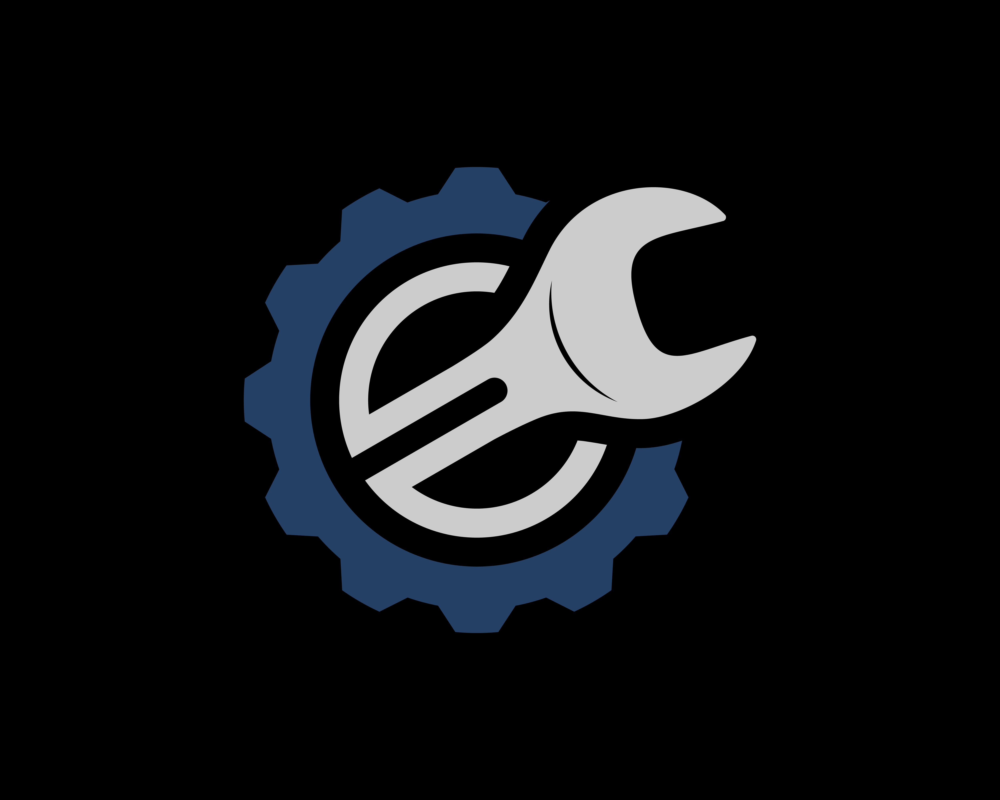

   

  

 

# WOTIVE Apps

GitHub Repositories of Bangkit Academy 2022 Capstone Project from 3 learning path. Machine Learning, Mobile development, Cloud Computing from team Capstone C22-PC400.

# About The Project

We come up with this project because, We can see people will get difficult if our vehicle or other people vehicle like Motorcycle, car, truck and and the others get break down at in the middle of nowhere and difficult to find workshop and to call mechanic to help us or other people and then, they can download at User cell phone and use this Our Application at emergency situation to help them find and call workshop to send mechanic to User location more easier to repair User vehicle. Or other function not just emergency situation we can use this application to call workshop to send mechanic come to your house or anything place and order just to fix or maintenance our vehicle.

# Team Members

## Team ID : B21-CAP0128

 

| Name                  | Student ID | Path                |
| --------------------- | ---------- | ------------------- |
| Anissa Dicky Putri    | M2002G0078 | Machine Learning    |
| Salsabila Rahma Anisa | M7454G3063 | Machine Learning    |
| Bima Ary Widiatmaja   | A2007G0660 | Android Development |
| Ahmad Gandi Kusumah   | C2369F2919 | Cloud Computing     |

 

